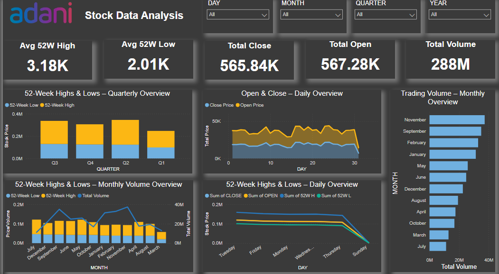

# 📈 Stock Data Analysis Dashboard (Power BI)

## 📌 Project Overview

This project is an interactive **Power BI Dashboard** developed to analyze the historical stock performance of **Adani Enterprises Ltd.** using market data from March 2025 to February 2026.

The dashboard provides valuable insights into stock price movements, trading volume, and 52-week High/Low trends through interactive visualizations and dynamic filters.

> **Note:** This repository contains a **Power BI Template (.pbit)**. When opened, Power BI will prompt you to connect the template to the provided dataset before generating the report.

---

## 📷 Dashboard Preview

---

## 📁 Dataset

- **Dataset Name:** Adani_Stock_Data_2025_2026.xlsx
- **Company:** Adani Enterprises Ltd.
- **Period Covered:** 17 March 2025 – 17 February 2026

---

## 📊 Key Performance Indicators (KPIs)

- Average 52-Week High
- Average 52-Week Low
- Total Open Price
- Total Close Price
- Total Trading Volume

---

## 📈 Dashboard Features

- Daily Open vs Close Price Analysis
- Monthly Trading Volume Analysis
- Quarterly High vs Low Comparison
- Monthly High vs Low Trend
- Interactive Time-Based Analysis
- Dynamic Filtering using Slicers

---

## 📊 Visualizations Used

- KPI Cards
- Line Chart
- Clustered Column Chart
- Clustered Bar Chart
- Combo Chart
- Slicers

---

## 🛠 Tools & Technologies

- Microsoft Power BI Desktop
- Power Query
- DAX
- Microsoft Excel

---

## 🚀 Key Insights

- Analyzed stock performance across different time periods.
- Compared daily Open and Close prices.
- Tracked 52-week High and Low values.
- Identified monthly trading volume trends.
- Created an interactive dashboard with dynamic filtering for better decision-making.
